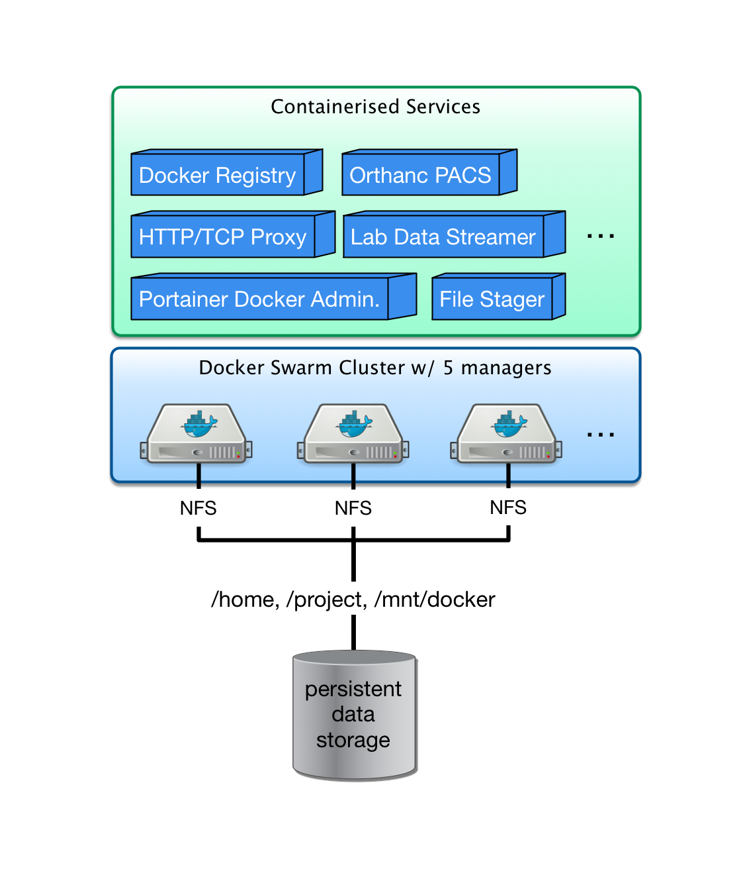

Docker swarm cluster at DCCN
****************************

The first swarm cluster at DCCN was developed in order to deploy and manage service components (e.g. DICOM services, data streamer, data stager) realising the automatic lab-data flow.  The inital setup consists of 8 nodes repurposed from the HPC and the EXSi clusters.

System architecture
===================

All docker nodes are bare-matel machines running CentOS operating system.  The nodes are provisioned using the DCCN linux-server kickstart. They all NFS-mount the ``/home`` and ``/project`` directories, and use the active directory service for user authentication and authorisation. Only the TG members are allowed to SSH login to the docker nodes.

All docker nodes also NFS-mount the ``/mnt/docker`` directory for sharing container data.  The figure below shows the architecture of the DCCN swarm cluster.

    
    The DCCN swarm cluster - a simplified illustration of the architecture.

Image registry
==============

Within the swarm cluster, a private image registry is provided to as a central repository of all container images. The data store of the registry is located in ``/mnt/docker/registry`` which is a shared NFS volume on the central storage.

The registry endpoint is ``docker-registry.dccn.nl:5000``. An overview of repository images can be seen `here <http://docker-registry.dccn.nl>`_.

.. Note::
    For the sake of simplicity, the internal private registry is not using the SSL encryption. Therefore the docker daemon needs to be instructed to trust the registry.  It can be done by adding ``insecure-registries`` in ``/etc/docker/daemon.json``.  For example,

    .. code-block:: json
       :emphasize-lines: 2

        {
            "insecure-registries": ["docker-registry.dccn.nl:5000"],
            "storage-driver": "devicemapper",
            "storage-opts": [
                 "dm.thinpooldev=/dev/mapper/docker-thinpool",
                 "dm.use_deferred_removal=true",
                 "dm.use_deferred_deletion=true"
            ]
        }

Service orchestration
=====================

For deploying multiple service components as a single application stack, the `docker compose specification v3 <https://docs.docker.com/compose/compose-file/>`_ is used together with the docker stack management interface (i.e. the ``docker stack`` command).

An example docker-compose file for orchestrating three services for the data-stager application is shown below:

.. _docker-compose-data-stager:

.. code-block:: none
    :linenos:

    version: "3"

    services:

        db:
            image: docker-registry.dccn.nl:5000/redis
            volumes:
                - /mnt/docker/data/stager/ui/db:/data
            networks:
                default:
                    aliases:
                        - stagerdb4ui
            deploy:
                placement:
                    constraints: [node.labels.function == production]

        service:
            image: docker-registry.dccn.nl:5000/stager:1.7.0
            ports:
                - 3100:3000
            volumes:
                - /mnt/docker/data/stager/config:/opt/stager/config
                - /mnt/docker/data/stager/cron:/cron
                - /mnt/docker/data/stager/ui/log:/opt/stager/log
                - /project:/project
                - /var/lib/sss/pipes:/var/lib/sss/pipes
                - /var/lib/sss/mc:/var/lib/sss/mc:ro
            networks:
                default:
                    aliases:
                        - stager4ui
            environment:
                - REDIS_HOST=stagerdb4ui
                - REDIS_PORT=6379
            depends_on:
                - db
            deploy:
                placement:
                    constraints: [node.labels.function == production]

        ui:
            image: docker-registry.dccn.nl:5000/stager-ui:1.1.0
            ports:
                - 3080:3080
            volumes:
                - /mnt/docker/data/stager/ui/config:/opt/stager-ui/config
            networks:
                default:
                    aliases:
                        - stager-ui
            depends_on:
                - service
            deploy:
                placement:
                    constraints: [node.labels.function == production]

    networks:
        default:

Whenever the docker compose specification is not applicable, a script to start a docker service is provided.  It is a bash script wrapping around the ``docker service create`` command.

All the scripts are located in the ``/mnt/docker/scripts/microservices`` directory.
