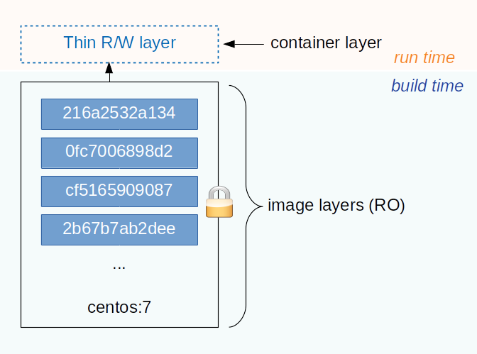

Exercise: the basic
*******************

In this exercise, you will build and spin off an Apache HTTPd container with PHP support.  Through it you will learn:

- the docker workflow and basic UI commands,
- network port exporting,
- data persistency

Preparation
===========

Download the file for this exercise:

.. code-block:: bash

    $ wget https://github.com/Donders-Institute/docker-swarm-setup/raw/master/doc/tutorial/centos-httpd/basic.tar.gz
    $ tar xvzf basic.tar.gz
    $ cd basic

The Dockerfile
==============

Before starting a container with Docker, we need a docker container image that is either pulled from a image registry (a.k.a. docker registry), such as the `Docker Hub <https://hub.docker.com>`_, or built by ourselves.  In this exercise, we are going to build a container image ourselves.

For building a docker image, one starts with writing an instruction file known as the `Dockerfile <https://docs.docker.com/engine/reference/builder/>`_.

Dockerfile is a `YAML <https://en.wikipedia.org/wiki/YAML>`_ document describing how a docker container should be built.  Hereafter is an example of the Dockerfile for an Apache HTTPd image:

.. _dockerfile-httpd:

.. code-block:: dockerfile
    :linenos:

    FROM centos:7
    MAINTAINER The CentOS Project <cloud-ops@centos.org>
    LABEL Vendor="CentOS" \
          License=GPLv2 \
          Version=2.4.6-40

    RUN yum -y --setopt=tsflags=nodocs update && \
        yum -y --setopt=tsflags=nodocs install httpd && \
        yum clean all

    EXPOSE 80

    # Simple startup script to avoid some issues observed with container restart
    ADD run-httpd.sh /run-httpd.sh
    RUN chmod -v +x /run-httpd.sh

    CMD ["/run-httpd.sh"]

The Dockerfile above is explained below.

Each line of the Dockerfile is taken as a *step* of the build.  It started with a **keyword** followed by **argument(s)**.

**Line 1:** all container images are built from a basis image.  This is indicated by the ``FROM`` keyword. In this example, the basis image is the official CentOS 7 image from the Docker Hub.

**Line 2-3:** a container image can be created with metadata.  For instance, the ``MAINTAINER`` and ``LABEL`` attributes are provided in the example.

**Line 8-10:** given that we want to build a image for running the Apache HTTPd server, we uses the YUM package manager to install the ``httpd`` package within the container.  It is done by using the ``RUN`` keyword followed by the actual YUM command.

**Line 12:** we know that the HTTPd service will run on port number 80, we expose that port explicitly for the connectivity.

**Line 14:** comments in Dockerfile are started with the ``#``.

**Line 15:** the `run-httpd.sh <https://raw.githubusercontent.com/Donders-Institute/docker-swarm-setup/master/doc/tutorial/centos-httpd/basic/run-httpd.sh>`_ is a script for bootstraping the HTTPd service after the container is started. In order to make this script available in the image, we make use of the ``ADD`` keyword here for *adding the file "run-httpd.sh" on the host into the root directory (i.e. /run-httpd.sh) of the container image*.

**Line 16:** here we make the HTTPd bootstrap script executable so that it can be run within the container.  It is done using the ``RUN`` keyword again.

**Line 18:** the keyword ``CMD`` specifies the command to be run when the container is started.  Here we simply run the bootstrap script we have just added into the container.

Building the container image
============================

Make sure you are in the ``basic`` folder, and run the following command:

.. code-block:: bash

    $ docker build -t httpd:centos . 

Here we give the image a *name:tag* with the ``-t`` option.  With that, the image can be later referred by ``httpd:centos``.

Keep your eyes on the output of the build process.  You will find the steps in the Dockerfile are executed sequencially, and some output (e.g. the output from ``yum install``) looks like as if you are running in a CentOS7 system.

What interesting to notice are lines with hash strings.  For example:

.. code-block:: none

    ---> 5182e96772bf
    Step 2/8 : MAINTAINER The CentOS Project <cloud-ops@centos.org>
    ---> Running in 52daee99ca6c
    Removing intermediate container 52daee99ca6c
    ---> cf9a7fe73efc

Image layers
------------

During the build process, each step in the Dockerfile triggers creation of two image layers.  One intermediate layer for executing the step; the other is a persistent layer containing results of the step.  Those layers are indicated by the hash strings we see in the output snippet above.

The intermediate layer is forked from the persistent layer of the previous step, except for the first step in which the persistent image is from an existing one built somewhere else (a reason that we always see keyword ``FROM`` as the first step in the Dockerfile). The intermediate layer is removed after the execution of the step.

Each persistent layer only consists of the "delta" to the one from its previous step. As illustrated in :numref:`containerlayers`, the final image is then constructed as a stack of those persisten layers; and it is locked for read-only.

.. _containerlayers:

    an illustration of the Docker image and container layers. This figure is inspired by the `one on the Docker document <https://docs.docker.com/storage/storagedriver/images/container-layers.jpg>`_.

Persistent layers are reused when they are encountered in different/independent build processes.  For example, the persistent layer created by the first step (``FROM centos:7``) is very likely to be reused for building a variety of container images based on CentOS 7.  In this case, Docker will reuse the image downloaded before instead of duplicating it for using the host's storage efficiently.

The image layers of a final docker image can be examinated by the ``docker history <image name:tag>`` command.  For example,

.. code-block:: bash

    $ docker history httpd:centos

Running the container
=====================

With the image built successfully, we can now start a container with the image using the ``docker run [options] <image name:tag>`` command.  For example,

.. code-block:: bash

    $ docker run --rm -d -p 8080:80 --name myhttpd httpd:centos

Let's connect the browser to the URL `http://localhost:8080 <http://localhost:8080>`_.  You will see a default welcome page of the Apache HTTPd server.

A few options are used here:

Option ``--rm`` instructs Docker to remove the container when the container is stopped.

Option ``-d`` instructs Docker to run the container in a detached mode.

Option ``-p`` instructs Docker to map the host's network port ``8080`` to the container's network port ``80`` so that this service is accessible from the host's external network.

Option ``--name`` names the container so that the container can be later referred easily.

Container layer
---------------

When running the container from a image, Docker creates a new writable layer (a.k.a. container layer) on top of the image layers.  Changes made within the container are delta to the image layers and kept in this container layer.  In this way, Docker makes the image layers read-only; and thus can be used by multiple independent containers without interference.

.. note::
    In fact, the way Docker organise deltas in the image layers and the container layer is similar to how the Linux life CD manages the filesystems.  They are both based on a stackable filesystem with the Copy-on-Write (CoW) strategy.

The concept of the image layers and the container layer is illustrated in :numref:`containerlayers`.

Data persistency
================

The default welcome page of the Apache HTTPd is boring.  We are going to create our own homepage.

Let's access to the bash shell of the running httpd container:

.. code-block:: bash

    $ docker exec -it myhttpd bash
    $ hostname

In Apache HTTPd, the way to replace the default homepage is creating our own ``index.html`` file within the folder ``/var/www/html``.  For example, using the command below to create a HTML form in ``/var/www/html/index.html``:

.. code-block:: bash

    $ cat > /var/www/html/index.html <<EOF
    <html>
    <head></head>
    <body>
    <h2>Welcome to my first HTML page served by Docker</h2>
    <form action="hello.php" method="POST">
        Your name: <input type="text" name="name"> 
        Your email: <input type="text" name="email"> 
    <input value="submit" name="submit" type="submit">
    </form>
    </body>
    </html>
    EOF

If you revisit the page `http://localhost:8080 <http://localhost:8080>`_, you will see the new homepage we just created.

Now imaging that we have to restart the container for a reason.  For that, we do:

.. code-block:: bash

    $ docker stop myhttpd
    $ docker run --rm -d -p 8080:80 --name myhttpd httpd:centos

Try connect to the page `http://localhost:8080 <http://localhost:8080>`_ again with the browser. **Do you see the homepage we just added to the container?**

.. hint::
    Changes made in the container are stored in the container layer which is only available during the container's lifetime.  When you stop the container, the container layer is removed from the host and thus the data in this layer is **NOT** persistent.

Volumes
-------

One way to persistent container data is using the so-called *volumes*. Volumes is managed by Docker and thus it is more portable and manageable.

For the example above, we could create a volume in Docker as

.. code-block:: bash

    $ docker volume create htmldoc

.. hint::
    One could use ``docker volume ls`` and ``docker volume inspect`` to list and inspect detail of a Docker volume.

When the volume is available, one could map the volume into the container's path ``/var/www/html``, using the ``-v`` option (i.e. line 3 in the commands below).

.. code-block:: bash
    :linenos:

    $ docker stop myhttpd
    $ docker run -rm -d -p 8080:80 \
    -v htmldoc:/var/www/html \
    --name myhttpd httpd:centos

Now get into the shell of the container, and create our own ``index.html`` again:

.. code-block:: bash

    $ docker exec -it myhttpd bash
    $ cat > /var/www/html/index.html <<EOF
    <html>
    <head></head>
    <body>
    <h2>Welcome to my first HTML page served by Docker</h2>
    <form action="hello.php" method="POST">
        Your name: <input type="text" name="name"> 
        Your email: <input type="text" name="email"> 
    <input value="submit" name="submit" type="submit">
    </form>
    </body>
    </html>
    EOF
    $ exist

Check if the new ``index.html`` is in place by reloading the page `http://localhost:8080 <http://localhost:8080>`_.

Restart the container again:

.. code-block:: bash

    $ docker stop myhttpd
    $ docker run -rm -d -p 8080:80 \
    -v htmldoc:/var/www/html \
    --name myhttpd httpd:centos

You should see the new ``index.html`` page is still available after restarting the container.

If you want to start from the scratch without any container data, one can simply remove the volume followed by creating a new one.

.. code-block:: bash

    $ docker volume rm htmldoc
    $ docker volume create htmldoc

Bind mounts
-----------

*Bind mount* is another way of keeping container data persistent by binding host's filesystem structure into the container.

Assuming we have a ``htmldoc`` directory on the host's filesystem, and there is a file ``index.html`` in this directory.

.. code-block:: bash

    $ pwd
    /home/honlee/tmp/basic/htmldoc
    $ ls
    index.html

We can then bind the directory ``/home/honlee/tmp/basic/htmldoc`` into the container's ``/var/www/html`` directory when starting the contianer.  The ``index.html`` file will then appear as ``/var/www/html/index.html`` within the container.  Use the following command:

.. code-block:: bash
    :linenos:

    $ docker stop myhttpd
    $ docker run -rm -d -p 8080:80 \
    -v /home/honlee/tmp/basic/htmldoc:/var/www/html \
    --name myhttpd httpd:centos

.. hint:
    While doing the bind mounts in the container, the benefit is that one can change the files on the host and the changes will take effect right in the container.
