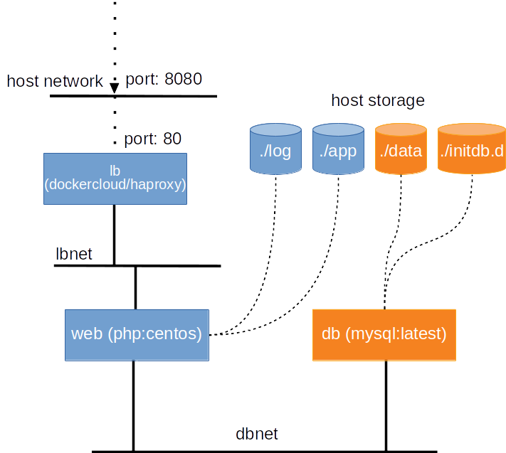

Tutorial: single-host orchestration
***********************************

This tutorial focuses on orchestrating multiple containers together on a single Docker host as an application stack. For doing so, we will be using the `docker-compose <https://docs.docker.com/compose/>`_ tool.

The application we are going to build is a user registration application.  The application has two interfaces, one is the user registration form; the other is an overview of all registered users.  Information of the registered users will be stored in the MySQL database; while the interfaces are built with PHP.

Throught the tutorial you will learn:

- the docker-compose file
- the usage of the docker-compose tool

Preparation
===========

The docker-compose tool is not immediately available after the Docker engine is installed on Linux.  Nevertheless, the installation is very straightforward as it's just a single binary file to be downloaded.  Follow the commands below to install it:

.. code-block:: bash

    $ sudo curl -L https://github.com/docker/compose/releases/download/1.22.0/docker-compose-$(uname -s)-$(uname -m) \
    -o /usr/local/bin/docker-compose
    $ chmod +x /usr/local/bin/docker-compose
    $ docker-compose --version

Files used in this tutorial are available on GitHub. Preparing those files within the ``~/tmp`` using the commands below:

.. code-block:: bash

    $ mkdir -p ~/tmp
    $ cd ~/tmp
    $ wget https://github.com/Donders-Institute/docker-swarm-setup/raw/master/doc/tutorial/centos-httpd/orchestration.tar.gz
    $ tar xvzf orchestration.tar.gz
    $ cd orchestration
    $ ls
    app  cleanup.sh  docker-compose.yml  initdb.d

.. important::

    In order to make the following commands in this tutorial work, you also need to prepare the files we used in the :ref:`tutorial-basic` section.

The docker-compose file
=======================

Container orchestration is to manage multiple containers in a controlled manner so that they work together as a set of integrated components.  The docker-compose file is to describe the containers and their relationship in the stack.  The docker-compose file is also written in `YAML <https://en.wikipedia.org/wiki/YAM>`_. Hereafter is the docker-compose file for our user registration application.

.. tip::
    The filename of the docker-compose file is usually ``docker-compose.yml`` as it is the default the ``docker-compose`` tool looks up in the directory.

.. code-block:: yaml
    :linenos:

    version: '3.1'

    networks:
        dbnet:

    services:
        db:
            image: mysql:latest
            hostname: db
            command: --default-authentication-plugin=mysql_native_password
            environment:
                - MYSQL_ROOT_PASSWORD=admin123
                - MYSQL_DATABASE=registry
                - MYSQL_USER=demo
                - MYSQL_PASSWORD=demo123
            volumes:
                - ./initdb.d:/docker-entrypoint-initdb.d
                - ./data:/var/lib/mysql
            networks:
                - dbnet
        web:
            build:
                context: ../basic
                dockerfile: Dockerfile_php
            image: php:centos
            volumes:
                - ./app:/var/www/html
                - ./log:/var/log/httpd
            networks:
                - dbnet
            ports:
                - 8080:80
            depends_on:
                - db

The docker-compose file above implements a service architecture shown in :numref:`apparchitecture` where we have two services (``web`` and ``db``) running in a internal network ``dbnet`` created on-demand.

.. tip::
    The docker-compose file starts with the keyword ``version``.  It is important to note that keywords of the docker-compose file are supported differently in different Docker versions. Thus, the keyword ``version`` is to tell the docker-compose tool which version it has to use for interpreting the entire docker-compose file.

    The compatibility table can be found `here <https://docs.docker.com/compose/compose-file/compose-versioning/>`_.

.. figure:: ../figures/app-service-architecture.png
    :name: apparchitecture
    :alt: illustration of the service architecture implemented by the docker-compose file in this tutorial.

    an illustration of the service architecture implemented by the docker-compose file used in this tutorial.

The service ``web`` uses the ``php:centos`` image we have built in :ref:`tutorial-basic`. It has two bind-mounts: one for the application codes (i.e. HTML and PHP files) and the other for making the HTTPd logs persistent on the host. The ``web`` service is attached to the ``dbnet`` network and has its network port 80 mapped to the port 8080 on the host.  Furthermore, it waits for the readiness of the ``db`` service before it can be started.

Another service ``db`` uses `the official MySQL image from the Docker Hub <https://hub.docker.com/_/mysql/>`_. According to the documentation of this official MySQL image, commands and environment variables are provided for initialising the database for our user registration application.

The ``db`` service has two bind-mounted volumes.  The ``./init.d`` directory on host is bind-mounted to the ``/docker-entrypoint-initdb.d`` directory in the container as we will make use the bootstrap mechanism provided by the container to create a database schema for the ``registry`` database; while the ``./data`` is bind-mounted to ``/var/lib/mysql`` for preserving the data in the MySQL database.  The ``db`` service is also joint into the ``dbnet`` network so that it becomes accessible to the ``web`` service.

Building services
=================

When the service stack has a container based on local image build (e.g. the ``web`` service in our example), it is necessary to build the container via the docker-compose tool.  For that, one can do:

.. code-block:: bash

    $ docker-compose build --force-rm

.. tip::

    The command above will loads the ``docker-compose.yml`` file in the current directory.  If you have a different filename/location for your docker-compose file, add the ``-f <filepath>`` option in front of the ``build`` command.

Bringing services up
====================

Once the docker-compose file is reasy, bring the whole service stack up is very simple.  Just do:

.. code-block:: bash

    $ docker-compose up -d
    Creating network "orchestration_dbnet" with the default driver
    Creating orchestration_db_1 ...
    Creating orchestration_db_1 ... done
    Creating orchestration_web_1 ...
    Creating orchestration_web_1 ... done

Let's check our user registration application by connecting the browser to `http://localhost:8080 <http://localhost:8080>`_.

service status
--------------

.. code-block:: bash

    $ docker-compose ps
           Name                      Command               State          Ports
    -----------------------------------------------------------------------------------
    orchestration_db_1    docker-entrypoint.sh --def ...   Up      3306/tcp, 33060/tcp
    orchestration_web_1   /run-httpd.sh                    Up      0.0.0.0:8080->80/tcp

service logs
------------

The services may produce logs to its STDOUT/STDERR.  Those logs can be monitored using

.. code-block:: bash

    $ docker-compose logs -f

where the option ``-f`` follows the output on STDOUT/STDERR.

Bringing services down
======================

.. code-block:: bash

    $ docker-compose down
    Stopping orchestration_web_1 ...
    Stopping orchestration_db_1  ...
    Removing orchestration_web_1 ... done
    Removing orchestration_db_1  ... done
    Removing network orchestration_dbnet

Exercise: HAProxy
=================

In this exercise, you are going to update the docker-compose file to add on top of the web service a HAProxy loadbalancer.  The overall architecture looks like the figure below:

    an illustration of the service architecture with HAProxy as the loadbalancer.

Step 1: add service ``dockercloud/haproxy``
-------------------------------------------

The HAProxy we are going to use is customised by DockerCloud, and is available `here <https://hub.docker.com/r/dockercloud/haproxy/>`_.  Adding the following service description into the ``docker-compose.yml`` file.

.. code-block:: yaml
    :linenos:

    lb:
        image: dockercloud/haproxy
        volumes:
            - /var/run/docker.sock:/var/run/docker.sock
        links:
            - web
        ports:
            - 8080:80
        depends_on:
            - web
        networks:
            - lbnet

.. tip::
    In real-world situation, it is very often to use existing container images from the Docker Hub.  It is a good practise to read the usage of the container image before using it.

Step 2: adjust ``web`` service
------------------------------

Task 1
^^^^^^

From the documentation of the ``dockercloud/haproxy``, it requires services attached to the proxy to set an environment variable ``SERVICE_PORT``.  The ``SERVICE_PORT`` of the ``web`` service is 80.

Could you modify the docker-compose file accordingly for it?

Task 2
^^^^^^

Instead of mapping host port 8080 to container port 80, we just need to join the ``web`` service into the network of the loadbalancer.

Could you modify the docker-compose file accordingly for it?

Step 3: add ``lbnet`` network
-----------------------------

We have made use of the network ``lbnet``; but we haven't ask the docker-compose to create it.

Could you modify the docker-compose file accordingly so that the network ``lbnet`` is created when bring up the services?

Service scaling
---------------

The final docker-compose file is available `here <https://github.com/Donders-Institute/docker-swarm-setup/blob/master/doc/tutorial/centos-httpd/orchestration/docker-compose.lb.yml>`_.

Save the file as ``docker-compose.lb.yml`` in the ``~/tmp/orchestration`` directory; and do the following to start the services:

.. code-block:: bash

    $ docker-compose -f docker-compose.lb.yml build --force-rm
    $ docker-compose -f docker-compose.lb.yml up

Try connecting to `http://localhost:8080 <http://localhost:8080>`_.  You should see the same user registration application.  Here we are not accessing the web service directory; but via the HAProxy.

With this setting, we can now scale up the web service whenever there is a load on it. For example, to create 2 the instances of the web service, one does:

.. code-block:: bash

    $ docker-compose -f docker-compose.lb.yml scale web=2
    $ docker-compose -f docker-compose.lb.yml ps
           Name                      Command               State                   Ports
    ----------------------------------------------------------------------------------------------------
    orchestration_db_1    docker-entrypoint.sh --def ...   Up      3306/tcp, 33060/tcp
    orchestration_lb_1    /sbin/tini -- dockercloud- ...   Up      1936/tcp, 443/tcp,0.0.0.0:8080->80/tcp
    orchestration_web_1   /run-httpd.sh                    Up      80/tcp
    orchestration_web_2   /run-httpd.sh                    Up      80/tcp

You should see two web services running on port 80.  You could try the followng curl command to check whether the loadbalancer does its job well:

.. code-block:: bash

    $ for i in {1..10}; do curl http://localhost:8080 2>/dev/null \
    | grep 'Served by host'; done
