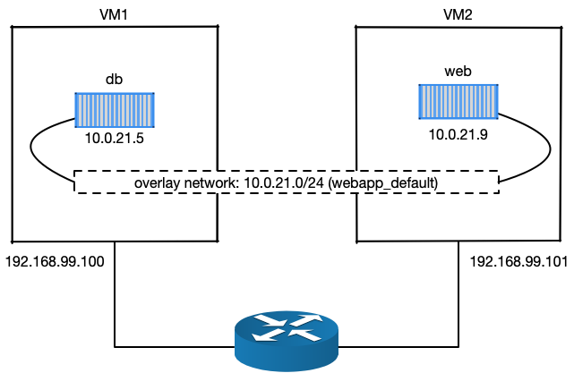
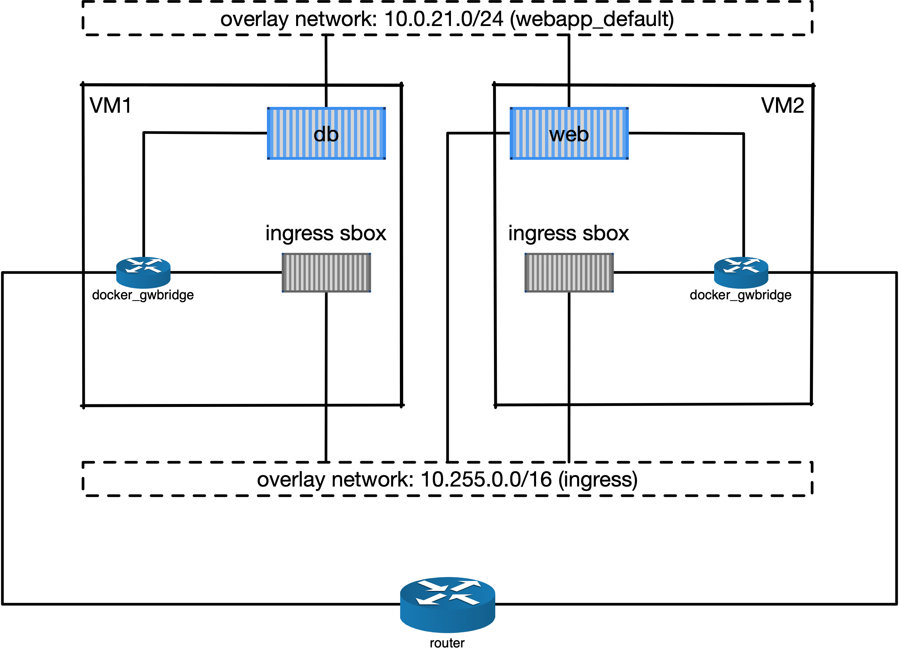

Tutorial: Docker swarm
**********************

In the previous tutorial, we have learnd about container orchestration for running a service stack with a feature of load balance.  However, the whole stack is running on a single Docker host, meaning that there will be service interruption when the host is down, a single point of failure.

In this tutorial, we are going to eliminate this single point of failure by orchestrating containers in a cluster of Docker nodes, a Docker swarm cluster.  We will revisit our web application developed in the :ref:`tutorial-orchestration` session, and make the web service redundent for eventual node failure.

You will learn:

- how to create a swarm cluster from scratch,
- how to deploy a stack in a swarm cluster,
- how to manage the cluster.

.. tip::
    Docker swarm is not the only solution for orchestrating containers on multiple computers.  A platform called `Kubenetes <https://kubernetes.io/>`_ was originally developed by Google and used in the many container infrastructure.

Preparation
===========

For this tutorial, we need multiple Docker hosts to create a swarm cluster.  For that, we are going to use the `docker machine <https://docs.docker.com/machine/>`_, a light weight virtual machine with Docker engine.

We will need to install `VirtualBox <https://virtualbox.org>`_ on the computer as the hypervisor for running the docker machines.  Follow the commands below to install the VirtualBox RPM.

.. code-block:: bash

    $ wget https://download.virtualbox.org/virtualbox/5.2.22/VirtualBox-5.2-5.2.22_126460_el7-1.x86_64.rpm
    $ sudo yum install VirtualBox-5.2-5.2.22_126460_el7-1.x86_64.rpm

Next step is to download the files prepared for this exercise:

.. code-block:: bash

    $ mkdir -p ~/tmp
    $ cd ~/tmp
    $ https://github.com/Donders-Institute/docker-swarm-setup/raw/master/doc/tutorial/centos-httpd/swarm.tar.gz
    $ tar xvzf swarm.tar.gz
    $ cd swarm

Bootstrap two docker machines with the prepared script:

.. code-block:: bash

    $ ./docker-machine-bootstrap.sh vm1 vm2

For your convenience, open two new terminals, each logs into one of the two virtual machines. For example, on terminal one, do

.. code-block:: bash

    $ docker-machine ssh vm1

On the second terminal, do

.. code-block:: bash

    $ docker-machine ssh vm2

Architecture
============

The architecture of the Docker swarm cluster is relatively simple comparing to other distributed container orchestration platforms. As illustrated in :numref:`swarmarchitecture`, each Docker host in the swarm cluster is either a *manager* or a *worker*.

By design, manager nodes are no difference to the worker nodes in sharing container workload; except that manager nodes are also responsible for maintaining the status of the cluster using a distributed state store.  Managers exchange information with each other in order to maitain sufficient quorum of the `Raft consensus <https://en.wikipedia.org/wiki/Raft_(computer_science)>`_ which is essential to the cluster fault tolerance.

.. figure:: ../figures/swarm-architecture.png
    :name: swarmarchitecture
    :alt: the swarm architecture.

    the swarm architecture, an illustration from `the docker blog <https://blog.docker.com/2016/06/docker-1-12-built-in-orchestration/>`_.

Service and stack
^^^^^^^^^^^^^^^^^

In the swarm cluster, a container can be started with multiple instances (i.e. replicas). The term *service* is used to refer to the replicas of the same container.

A *stack* is referred to a group of connected *services*.  Similar to the single-node orchestration, a stack is also described by a *docker-compose* file with extra attributes specific for the Docker swarm.

Creating a cluster
==================

Docker swarm is essentially a "mode" of the Docker engine.  This mode has been introduced to the Docker engine since version 1.12 in 2016. To create a new cluster, we just need to pick up the first Docker host (`vm1` for instance) and do:

.. code-block:: bash

    [vm1]$ docker swarm init --advertise-addr 192.168.99.100

.. note::
    The ``--advertise-addr`` should be the IP address of the docker machine.  It may be different in different system.

.. note::
    The notation ``[vm1]`` on the command-line prompt indicates that the command should be executed on the specified docker machine.  All the commands in this tutorial follow the same notation.  If there is no such notation on the prompt, the command is performed on the host of the docker machines.

After that you could check the cluster using

.. code-block:: bash

    [vm1]$ docker node ls
    ID                            HOSTNAME            STATUS              AVAILABILITY        MANAGER STATUS      ENGINE VERSION
    svdjh0i3k9ty5lsf4lc9d94mw *   vm1                 Ready               Active              Leader              18.06.1-ce

Et voilà! You have just created a swarm cluster, as simple as one command... Obviously, it is a cluster with only one node, and the node is by default a manager. Since it is the only manager, it is also the leading manager (*Leader*).

Join tokens
===========

Managers also hold tokens (a.k.a. join token) for other nodes to join the cluster. There are two join tokens; one for joining the cluster as a mansger, the other for a worker. To retrieve the token for the manager, use the following command on the first manager.

.. code-block:: bash

    [vm1]$ docker swarm join-token manager
    To add a manager to this swarm, run the following command:

        docker swarm join --token SWMTKN-1-2i60ycz95dbpblm0bewz0fyypwkk5jminbzpyheh7yzf5mvrla-1q74k0ngm0br70ur93h7pzdg4 192.168.99.100:2377

For the worker, one does

.. code-block:: bash

    [vm1]$ docker swarm join-token worker
    To add a worker to this swarm, run the following command:

        docker swarm join --token SWMTKN-1-2i60ycz95dbpblm0bewz0fyypwkk5jminbzpyheh7yzf5mvrla-9br20buxcon364sgmdbcfobco 192.168.99.100:2377

The output of these two commands simply tells you what to run on the nodes that are about to join the cluster.

Adding nodes
============

Adding nodes is done by executing the command suggested by the ``docker swarm join-token`` on the node that you are about to add.  For example, let's add our second docker machine (``vm2``) to the cluster as a manager:

.. code-block:: bash

    [vm2]$ docker swarm join --token \
    SWMTKN-1-2i60ycz95dbpblm0bewz0fyypwkk5jminbzpyheh7yzf5mvrla-1q74k0ngm0br70ur93h7pzdg4 \
    192.168.99.100:2377

After that, you can see the cluster has more nodes available.

.. code-block:: bash

    [vm2]$ docker node ls
    ID                            HOSTNAME            STATUS              AVAILABILITY        MANAGER STATUS      ENGINE VERSION
    svdjh0i3k9ty5lsf4lc9d94mw     vm1                 Ready               Active              Leader              18.06.1-ce
    m5r1j48nnl1u9n9mbr8ocwoa3 *   vm2                 Ready               Active              Reachable           18.06.1-ce

.. note::
    The ``docker node`` command is meant for managing nodes in the cluster, and therefore, it can only be executed on the manager nodes.  Since we just added ``vm2`` as a manager, we could do the ``docker node ls`` right away.

Labeling nodes
^^^^^^^^^^^^^^

Sometimes it is useful to lable the nodes.  Node lables are useful for container placement on nodes.  Let's now lable the two nodes with *os=linux*.

.. code-block:: bash

    [vm1]$ docker node update --label-add os=linux vm1
    [vm1]$ docker node update --label-add os=linux vm2

Promoting and demoting nodes
^^^^^^^^^^^^^^^^^^^^^^^^^^^^

The manager node can demote other manager to become worker or promote worker to become manager. This dynamics allows administrator to ensure sufficient amount of managers (in order to maintain the state of the cluster); while some manager nodes need to go down for maintenance.  Let's demote ``vm2`` from manager to worker:

.. code-block:: bash

    [vm1]$ docker node demote vm2
    Manager vm2 demoted in the swarm.

    [vm1]$ docker node ls
    ID                            HOSTNAME            STATUS              AVAILABILITY        MANAGER STATUS      ENGINE VERSION
    svdjh0i3k9ty5lsf4lc9d94mw *   vm1                 Ready               Active              Leader              18.06.1-ce
    m5r1j48nnl1u9n9mbr8ocwoa3     vm2                 Ready               Active                                  18.06.1-ce

Promote the ``vm2`` back to manager:

.. code-block:: bash

    [vm1]$ docker node promote vm2
    Node vm2 promoted to a manager in the swarm.

docker-compose file for stack
=============================

The following docker-compose file is modified from the one we used in the :ref:`tutorial-orchestration`.  Changes are:

* we stripped down the network part,
* we added container placement requirements via the ``deploy`` section,
* we persistented MySQL data in a docker volume (*due to the fact that I don't know how to make bind-mount working with MySQL container in a swarm of docker machines*),
* we made use of a private docker image registry for the ``web`` service.

.. code-block:: yaml
    :linenos:

    version: '3.1'

    networks:
        default:

    volumes:
        dbdata:
        weblog:

    services:
        db:
            image: mysql:latest
            hostname: db
            command: --default-authentication-plugin=mysql_native_password
            environment:
                - MYSQL_ROOT_PASSWORD=admin123
                - MYSQL_DATABASE=registry
                - MYSQL_USER=demo
                - MYSQL_PASSWORD=demo123
            volumes:
                - ./initdb.d:/docker-entrypoint-initdb.d
                - dbdata:/var/lib/mysql
            networks:
                - default
            deploy:
                restart_policy:
                    condition: none
                mode: replicated
                replicas: 1
                placement:
                    constraints:
                        - node.hostname == vm1
        web:
            build:
                context: ./app
            image: docker-registry.dccn.nl:5000/demo_user_register:1.0
            volumes:
                - weblog:/var/log/httpd
            networks:
                - default
            ports:
                - 8080:80
            depends_on:
                - db
            deploy:
                mode: replicated
                replicas: 1
                placement:
                    constraints:
                        - node.hostname == vm2
                        - node.labels.os == linux

Launching stack
===============

The docker-compose file above is already provided as part of the downloaded files in the preparation step.  The filename is ``docker-compose.swarm.yml``. Follow the steps below to start the application stack.

#. On ``vm1``, go to the directory in which you have downloaded the files for this tutorial.  It is a directory mounted under the ``/hosthome`` directory in the VM, e.g.

    .. code-block:: bash

        [vm1]$ cd /hosthome/tg/honlee/tmp/swarm

#. Login to the private Docker registry with user *demo*:

    .. code-block:: bash

        [vm1]$ docker login docker-registry.dccn.nl:5000

#. Start the application stack:

    .. code-block:: bash

        [vm1]$ docker stack deploy -c docker-compose.swarm.yml --with-registry-auth webapp
        Creating network webapp_default
        Creating service webapp_db
        Creating service webapp_web

    .. note::
        The ``--with-registry-auth`` is very important for pulling image from the private repository.

#. Check if the stack is started properly:

    .. code-block:: bash

        [vm1]$ docker stack ps webapp
        ID                  NAME                IMAGE                                                 NODE                DESIRED STATE       CURRENT STATE           ERROR               PORTS
        j2dqr6xs9838        webapp_db.1         mysql:latest                                          vm1                 Running             Running 2 seconds ago                      
        drm7fexzlb9t        webapp_web.1        docker-registry.dccn.nl:5000/demo_user_register:1.0   vm2                 Running             Running 4 seconds ago

#. Note that our web service (``webapp_web``) is running on ``vm2``.  So it is obvous that if we try to get the index page from ``vm2``, it should work.  Try the following commands on the host of the two VMs.

    .. code-block:: bash

        $ docker-machine ls
        NAME   ACTIVE   DRIVER       STATE     URL                         SWARM   DOCKER        ERRORS
        vm1    -        virtualbox   Running   tcp://192.168.99.100:2376           v18.06.1-ce   
        vm2    -        virtualbox   Running   tcp://192.168.99.101:2376           v18.06.1-ce   

        $ curl http://192.168.99.101:8080

    But you should note that getting the page from another VM ``vm1`` works as well even though the container is not running on it:

    .. code-block:: bash

        $ curl http://192.168.99.100:8080

    This is the magic of Docker swarm's `routing mesh <https://docs.docker.com/engine/swarm/ingress/>`_ mechanism, which provides intrinsic feature of load balance and failover.

Since we are running this cluster on virtual machines, the web service is not accessible via the host's IP address.  The workaround we are doing below is to start a NGINX container on the host, and proxy the HTTP request to the web service running on the VMs.

    .. code-block:: bash

        $ cd /home/tg/honlee/tmp/swarm
        $ docker-compose -f docker-compose.proxy.yml up -d
        $ docker-compose -f docker-compose.proxy.yml ps
        Name              Command          State         Ports       
        -----------------------------------------------------------------
        swarm_proxy_1   nginx -g daemon off;   Up      0.0.0.0:80->80/tcp

.. tip::
    This workaround is also applicable for a production environment.  Imaging you have a swarm cluster running in a private network, and you want to expose a service to the Internet.  What you need is a gateway machine proxying requests from Internet to the internal swarm cluster. `NGINX <https://www.nginx.com/>`_ is a very powerful engine for proxying HTTP traffic.  It also provides capability of load balancing and failover.

    You may want to have a look of the NGINX configuration in the ``proxy.conf.d`` directory (part of the downloaded files) to see how to leverage on the Docker swarm's routing mesh mechanism (discussed below) for load balance and failover.

Docker registry
^^^^^^^^^^^^^^^

One benefit of using Docker swarm is that one can bring down a Docker node and the system will migrate all containers on it to other nodes.  This feature assumes that there is a central place where the Docker images can be pulled from.

In the example docker-compose file above, we make use of the official MySQL image from the DockerHub and the ``demo_user_register:1.0`` image from a private registry, ``docker-registry.dccn.nl``.  This private registry requires user authentication, therefore we need to login to this registry before starting the application stack.

Overlay network
^^^^^^^^^^^^^^^

The following picuture illustats the network setup we have created with the ``webapp`` stack.  The way Docker swarm interconnects containers on different docker hosts is using the so-called *overlay network*.

Technical details on how Docker swarm sets up the overlay network is described in `this blog by Nigel Poulton <http://blog.nigelpoulton.com/demystifying-docker-overlay-networking/>`_. In short, the overlay network makes use of the `virtual extensible LAN (VXLAN) tunnel <https://en.wikipedia.org/wiki/Virtual_Extensible_LAN>`_ to route layer 2 traffic accross IP networks.

    An illustration of the Docker overlay network.

.. hint::
    There are also YouTube videos explaining the Docker overlay network.  For example, the `Deep dive in Docker Overlay Networks by Laurent Bernaille <https://www.youtube.com/watch?v=b3XDl0YsVsg>`_ is worth for watching.

Container placement
^^^^^^^^^^^^^^^^^^^

You may notice that the containers ``db`` and ``web`` services are started on a node w.r.t. the container placement requirement we set in the docker-compose file.  You can dynamically change the requirement, and the corresponding containers will be moved accordingly to meet the new requirement.  Let's try to move the container of the ``web`` service from ``vm2`` to ``vm1`` by setting the placement constraint.

Get the current placement constraints:

.. code-block:: bash

    [vm1]$ docker service inspect \
    --format='{{.Spec.TaskTemplate.Placement.Constraints}}' webapp_web
    [node.hostname == vm2 node.labels.os == linux]

Move the container from ``vm2`` to ``vm1`` by removing the constraint ``node.hostname == vm2`` followed by addeing ``node.hostname == vm1``:

.. code-block:: bash

    [vm1]$ docker service update \
    --constraint-rm 'node.hostname == vm2' \
    --with-registry-auth webapp_web

.. note::
    By removing the constraint ``node.hostname == vm2``, the container is not actually moved since the node the container is currently running on, ``vm2``, fulfills the other constraint ``node.labels.os == linux``.

.. code-block:: bash

    [vm1]$ docker service update \
    --constraint-add 'node.hostname == vm1' \
    --with-registry-auth webapp_web

Check again the location of the container.  It should be moved to ``vm1`` due to the newly added constraint.

.. code-block:: bash

    [vm1]$ docker service ps --format='{{.Node}}' webapp_web
    vm1

    [vm1]$ docker service inspect \
    --format='{{.Spec.TaskTemplate.Placement.Constraints}}' webapp_web
    [node.hostname == vm1 node.labels.os == linux]

Let's now remove the hostname constaint:

.. code-block:: bash

    [vm1]$ docker service update \
    --constraint-rm 'node.hostname == vm1' \
    --with-registry-auth webapp_web

    [vm1]$ docker service inspect \
    --format='{{.Spec.TaskTemplate.Placement.Constraints}}' webapp_web
    [node.labels.os == linux]

Network routing mesh
^^^^^^^^^^^^^^^^^^^^

In the Docker swarm cluster, routing mesh is a mechanism making services exposed to the host's public network so that they can be accessed externally. This mechanism also enables each node in the cluster to accept connections on published ports of any published service, even if the service is not running on the node.

Routing mesh is based on an overlay network (``ingress``) and a `IP Virtual Servers (IPVS) <http://www.linuxvirtualserver.org/software/ipvs.html>`_ load balancer (via a hindden ``ingress-sbox`` container) running on each node of the swarm cluster.

The figure below illustrates the overall network topology of the ``webapp`` stack with the ``ingress`` network and ``ingress-sbox`` load balancer for the routing mesh.

    An illustration of the Docker ingress network and routing mesh.

Service management
==================

Scaling
^^^^^^^

Service can be scaled up and down by updating the number of *replicas*.  Let's scale the ``webapp_web`` service to 2 replicas:

.. code-block:: bash

    [vm1]$ docker service ls
    ID                  NAME                MODE                REPLICAS            IMAGE                                                 PORTS
    qpzws2b43ttl        webapp_db           replicated          1/1                 mysql:latest                                          
    z92cq02bqr4b        webapp_web          replicated          1/1                 docker-registry.dccn.nl:5000/demo_user_register:1.0   *:8080->80/tcp

    [vm1]$ docker service update --replicas 2 webapp_web

    [vm1]$ docker service ls
    ID                  NAME                MODE                REPLICAS            IMAGE                                                 PORTS
    qpzws2b43ttl        webapp_db           replicated          1/1                 mysql:latest                                          
    z92cq02bqr4b        webapp_web          replicated          2/2                 docker-registry.dccn.nl:5000/demo_user_register:1.0   *:8080->80/tcp

Rotating update
^^^^^^^^^^^^^^^

Since we have two ``webapp_web`` replicas running in the cluster, we could now perform a rotating update without service downtime.

Assuming that the app developer has update the Docker registry with a new container image, the new image name is ``docker-registry.dccn.nl:5000/demo_user_registry:2.0``, and we want to apply this new image in the cluster without service interruption.  To achieve it, we do a rotating update on the service ``webapp_web``.

To demonstrate the non-interrupted update, let's open a new terminal and keep pulling the web page from the service:

.. code-block:: bash

    $ while true; do curl http://192.168.99.100:8080 2>/dev/null | grep 'Served by host'; sleep 1; done

Use the following command to perform the rotating update:

.. code-block:: bash

    [vm1]$ docker service update \
    --image docker-registry.dccn.nl:5000/demo_user_register:2.0 \
    --update-parallelism 1 \
    --update-delay 10s \
    --with-registry-auth webapp_web

Node management
===============

Sometimes we need to perform maintenance on a Docker node.  In the Docker swarm cluster, one first drains the containers on the node we want to maintain.  This is done by setting the node's availability to ``drain``.  For example, if we want to perform maintenance on ``vm2``:

.. code-block:: bash

    [vm1]$ docker node update --availability drain vm2
    [vm1]$ docker node ls
    ID                            HOSTNAME            STATUS              AVAILABILITY        MANAGER STATUS      ENGINE VERSION
    svdjh0i3k9ty5lsf4lc9d94mw *   vm1                 Ready               Active              Leader              18.06.1-ce
    m5r1j48nnl1u9n9mbr8ocwoa3     vm2                 Ready               Drain               Reachable           18.06.1-ce

Once you have done that, you will notice all containers running on ``vm2`` are automatically moved to ``vm1``.

.. code-block:: bash

    [vm1]$ docker stack ps webapp
    ID                  NAME                IMAGE                                                 NODE                DESIRED STATE       CURRENT STATE             ERROR               PORTS
    cwoszv8lupq3        webapp_web.1        docker-registry.dccn.nl:5000/demo_user_register:2.0   vm1                 Running             Running 41 seconds ago                        
    rtv2hndyxveh         \_ webapp_web.1    docker-registry.dccn.nl:5000/demo_user_register:2.0   vm2                 Shutdown            Shutdown 41 seconds ago                       
    3he78fis5jkn         \_ webapp_web.1    docker-registry.dccn.nl:5000/demo_user_register:1.0   vm2                 Shutdown            Shutdown 6 minutes ago                        
    675z5ukg3ian        webapp_db.1         mysql:latest                                          vm1                 Running             Running 14 minutes ago                        
    mj1547pj2ac0        webapp_web.2        docker-registry.dccn.nl:5000/demo_user_register:2.0   vm1                 Running             Running 5 minutes ago                         
    yuztiqacgro0         \_ webapp_web.2    docker-registry.dccn.nl:5000/demo_user_register:1.0   vm1                 Shutdown            Shutdown 5 minutes ago                

After the maintenance work, just set the node's availability to ``active`` again:

.. code-block:: bash

    [vm1]$ docker node update --availability active vm2

And run the following command to rebalance the service so that two replicas runs on two different nodes:

.. code-block:: bash

    [vm1]$ docker service update --force --with-registry-auth webapp_web

